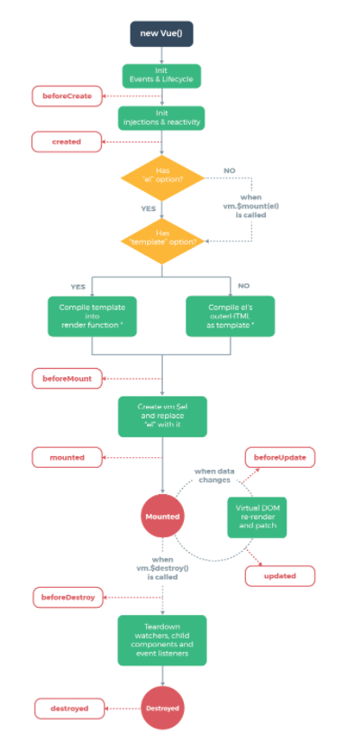

# Vue Mapbox Template

## Prerequisites

- Knowledge of *Git* flow
- [Node.js](https://nodejs.org/en/)
- [Vue-CLI](https://cli.vuejs.org/)
- [Mapbox-Account](https://www.mapbox.com/mapbox-studio)

## Data

Tree data test is from [NYC Open Data](https://data.cityofnewyork.us/Environment/2015-Street-Tree-Census-Tree-Data/pi5s-9p35)

## Vue Lifecycle

## Development

### Installing Dependencies

`npm install`

### Starting Local Server

`npm run serve`

### Lint

`npm run lint`